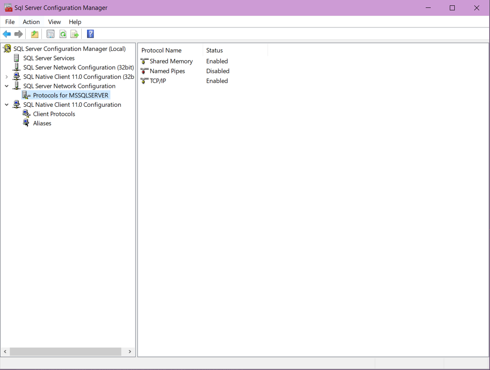
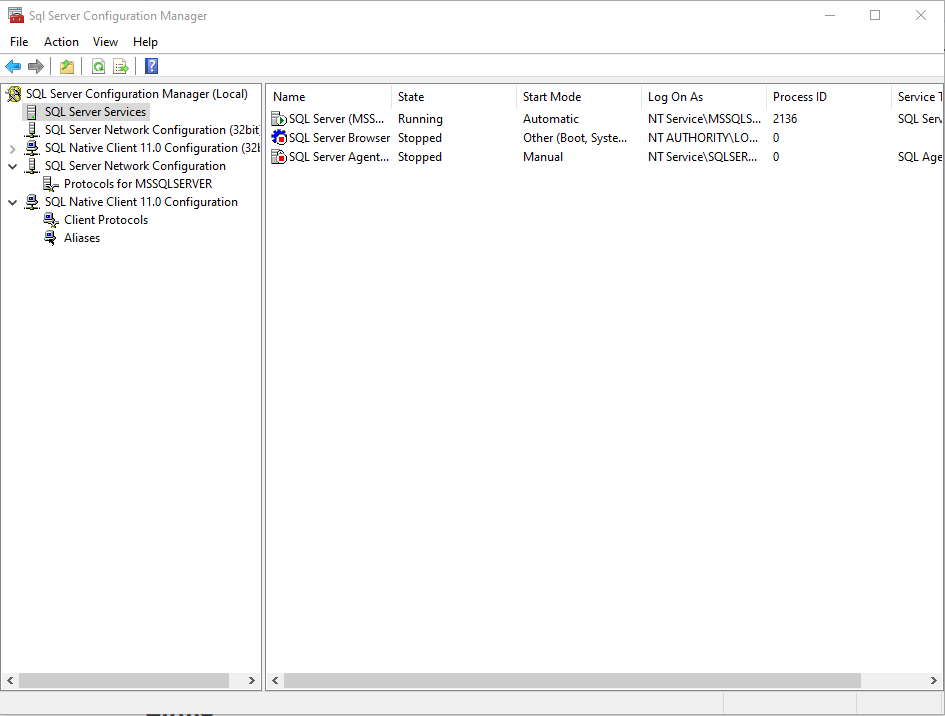
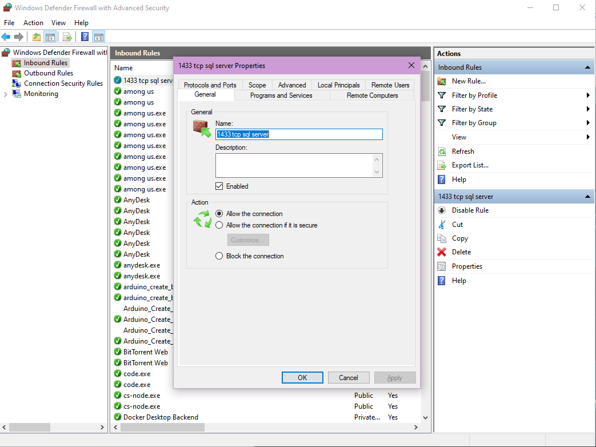
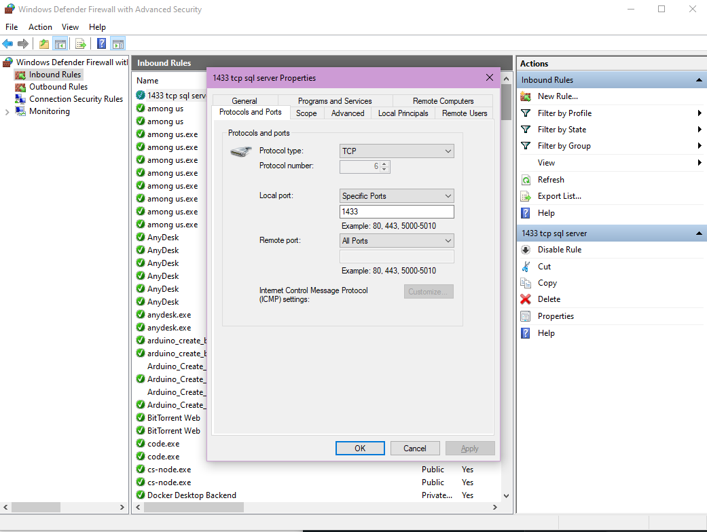

# Using DAGs for ETL development with Pandas
First we recommend to use a venv. In Linux it is done by:

```bash
    python3 -m venv /path/to/new/virtual/environment
```
Then, we should start it by:
```bash
    source /path/to/new/virtual/environment/bin/activate
```
Here we have to make sure to downgrade or upgrade to the specific pip version:
```bash
    pip install --upgrade pip==20.2.4
```
After this, we just have to follow the steps in [Airflow Documentation Quick Start](https://airflow.apache.org/docs/apache-airflow/stable/start/local.html). 

After, we have the airflow webserver and airflow scheduler running in different terminals we can test our DAGs


## Connection to Microsoft SQL Server
The first thing we should download is the SQL Server. We can choose from the [Develoment version or the Express version](https://www.microsoft.com/es-es/sql-server/sql-server-downloads).

After that we should install it and then we can procede to install the [SQL Server Management Studio](https://docs.microsoft.com/en-us/sql/ssms/download-sql-server-management-studio-ssms?view=sql-server-ver15) to have a GUI where we can manage our SQL Server. Of course, we can just use the command line.

Once, we have all the components of MSQL Server installed, we can start to create a test database, and a table where we want to write new registers from Pandas. Now, we should stablish a comunication from the SQL Server to our WSL enviroment. then, we need to follow these steps:

1. We have to enable the TCP/IP connections of the SQL Server
To do this task, we start by pressing **Windows + R** and in the Run Windows we type **	SQLServerManager15.msc** to open the SQL server configuration Manager. **Note**The command is valid fort SQL Server 2019 version, you can check the right command for your version [here](https://www.sqlshack.com/how-to-use-sql-server-configuration-manager/#:~:text=The%20SQL%20Server%20configuration%20manager,msc%E2%80%9D%20file.)

2. Inside the SQL Server Manager, we go to the SQL Server network configuration and select the protocl for MSSQLSERVER and enable the TCP/IP option by right clicking in the item. 


3. After that, we go to the SQL Server Services and restart the SQL Server running so the changes are applied.


4. Then, we should allow this port in the Windows firewall using an Inbound rule in the port we select for TCP:



Now we have to connect from WSL2 to the SQL Server to use Airflow and the tasks we have created. Then, the first thing we need is to install the ODBC driver for our distribution of linux in WSL. Here is the web page for the different versions of [MSQL ODBC for linux](https://docs.microsoft.com/en-us/sql/connect/odbc/linux-mac/installing-the-microsoft-odbc-driver-for-sql-server?view=sql-server-ver15#ubuntu17). In this case, we have use Ubuntu in WSL2, then we are using the same version for the installation of the ODBC. In the link above there is a bash script for Ubuntu distribution wich install the ODBC and place it by default into **/opt/microsoft/msodbcsql17/lib64/libmsodbcsql-17.7.so.1.1**. 


